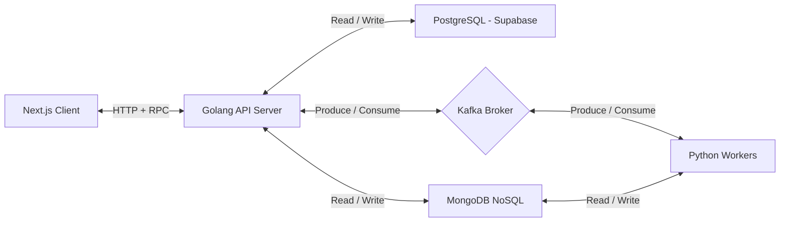

# Financial Chatbot with LLM Integration

## Overview

This is a personal project designed as a financial chatbot that leverages OpenAI’s LLM via LangChain and Plaid to provide real-time conversational insights based on users' financial data. The system demonstrates a modern microservice-inspired architecture, combining frontend, backend, async processing, and streaming technologies.

---

## Architecture

### Architecture Diagram

### Components

- **Next.js Client**  
  - Frontend UI that interacts with users, sending and receiving chat messages.
  - Uses server rendered and client rendered components.
  - Uses motion (previously framer motion) for dynamic UI interactions.
  - Implements shadcn components for a modern look and feel.

- **Golang API**  
  - Acts as the primary backend service.
  - Handling client requests and authentication.
  - Managing relational data (Supabase/PostgreSQL) such as user profiles, conversations, and secure Plaid tokens.
  - Managing NoSQL data (MongoDB) for storing and creating contextual and message documents.
  - Acting as the Kafka producer and consumer, facilitating communication between the client and Python worker.
  - Streaming responses to the client via Server-Sent Events (SSE).
  - Uses RPC framework for communication

- **Python Worker(s)**  
  - Asynchronous workers to handle LLM response generation.
  - Consume user message requests from Kafka.
  - Use LangChain and OpenAI API to generate LLM responses.
  - Produce real time chunk streaming response messages back into Kafka.

- **Kafka**  
  Message broker used for decoupling communication between Golang API and Python workers, supporting asynchronous processing and streaming.

---

## Design Choices

### 1. **Microservice-inspired, Polyglot Architecture**

- **Why?**  
  Separation of concerns allows independent development, deployment, and scaling of the backend API and the LLM processing workers. Choosing Golang for API robustness and Python for AI/ML integration leverages the strengths of each language.

- **Benefits:**  
  - Clear service boundaries improve maintainability.
  - Independent scaling based on load.
  - Use of best-suited languages/tools per component.

- **Drawbacks:**  
  - Increased operational complexity.
  - Requires careful coordination and schema management (Kafka message contracts).
  - More complex debugging and deployment.

### 2. **Kafka for Message Brokering**

- **Why?**  
  Kafka provides durable, scalable, and asynchronous messaging between the Golang API and Python workers. It decouples message producers and consumers and supports streaming.

- **Benefits:**  
  - Loose coupling improves fault tolerance.
  - Scalability with partitioning.
  - Enables asynchronous processing, improving responsiveness.

- **Drawbacks:**  
  - Kafka setup and management add operational overhead.
  - Requires message schema management and versioning discipline.
  - Adds latency compared to direct RPC calls.

### 3. **Server-Sent Events (SSE) for Streaming**

- **Why?**  
  SSE enables real-time streaming of partial LLM responses from the Golang API to the Next.js client, creating an interactive chat experience.

- **Benefits:**  
  - Lightweight and easy to implement compared to WebSockets.
  - Works well for unidirectional, real-time message streaming.
  - Native browser support.

- **Drawbacks & Concerns:**  
  - Currently, a single goroutine consumes Kafka and streams to clients, which may become a bottleneck under heavy load.
  - SSE is unidirectional and less flexible than WebSockets for bidirectional communication.
  - Requires handling reconnection logic on the client side to ensure no message loss.

### 4. **Use of Multiple Databases (Relational + NoSQL)**

- **Why?**  
  - Relational database (Supabase/PostgreSQL) handles structured data such as user credentials, conversations metadata, and preferences.
  - NoSQL database (MongoDB) stores context documents used for LLM prompt construction.

- **Benefits:**  
  - Each database type is used for what it’s best at, improving efficiency.
  - Enables flexible, scalable document storage for unstructured data.

- **Drawbacks:**  
  - Data consistency across databases needs careful management.
  - Increased complexity in data modeling and querying.

---

## Known Limitations & Future Improvements

- **Single Goroutine Bottleneck**  
  The current implementation uses a single Kafka consumer goroutine to handle SSE streaming, which could limit scalability and throughput. Future work includes implementing a consumer pool or partition-based consumer groups to handle higher concurrency.

- **Operational Complexity**  
  The architecture’s complexity introduces challenges in deployment, monitoring, and debugging. Implementing observability tools (e.g., distributed tracing, centralized logging) would improve maintainability.

- **Latency Due to Async Processing**  
  The use of Kafka for async message passing and LLM processing introduces inherent latency. Optimizations around worker concurrency, prefetching, or caching could help reduce response times.

- **Connection Management & Fault Tolerance**  
  SSE connections can be fragile; clients must handle reconnects, and the server should implement mechanisms to resume streams gracefully to avoid data loss.

---

## What I Learned

- How to design and implement a multi-language, asynchronous microservice-inspired system.
- Practical experience with Kafka for decoupled message brokering.
- Integrating LLM APIs in a scalable architecture.
- Handling real-time streaming to clients using SSE.
- Balancing architectural trade-offs between simplicity, scalability, and maintainability.

---

## How to Run

*Instructions on how to set up Kafka, run the Golang API, Python workers, and Next.js client.*

---

## Contact & Feedback

Feel free to reach out for questions, suggestions, or collaboration!
